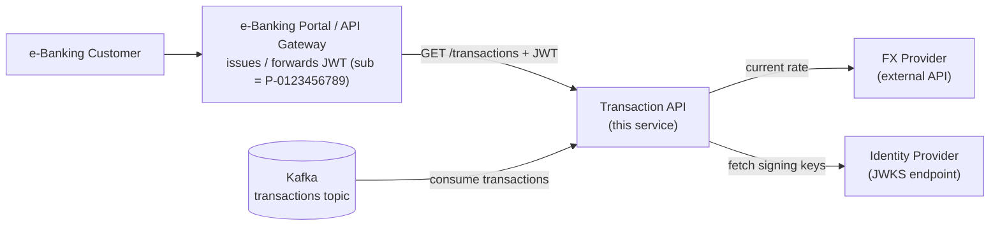
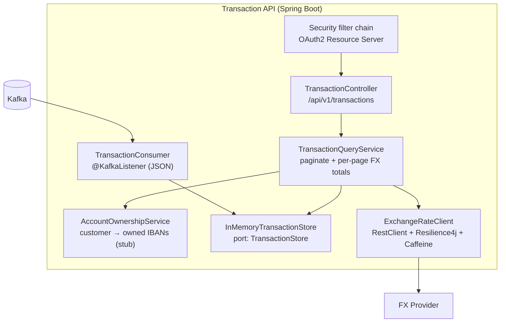
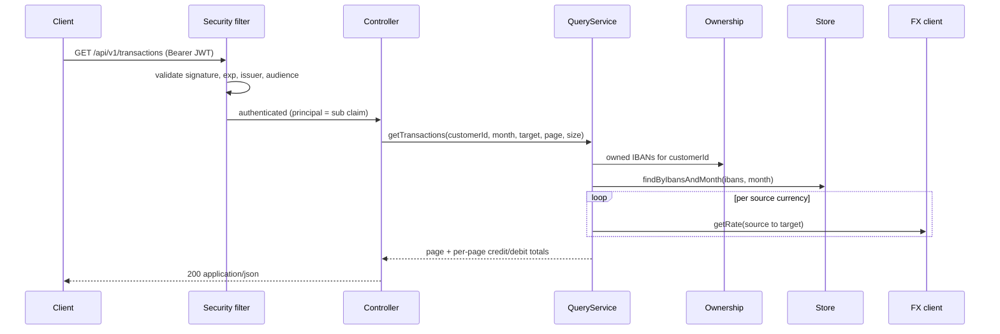

# Transaction API

A reusable REST microservice for an e-Banking portal: it returns a **paginated list of a
logged-on customer's account transactions for a calendar month**, and for each page the
**total credit and debit converted to a requested currency at the current exchange rate**.
Transactions are sourced from a **Kafka** topic; the service is containerised and ships with
**Kubernetes** manifests.

- **Java 21**, **Spring Boot 4.0.6**, Maven
- CI (unit + integration): **CircleCI** → https://app.circleci.com/pipelines/github/HermitKW/e-Banking-Portal

## Contents
1. [What it does](#1-what-it-does)
2. [Run it locally](#2-run-it-locally)
3. [Architecture](#3-architecture)
4. [How the requirements are met](#4-how-the-requirements-are-met)
5. [Data model & money](#5-data-model--money)
6. [API contract](#6-api-contract)
7. [Security](#7-security)
8. [Data access & schema evolution](#8-data-access--schema-evolution)
9. [Observability](#9-observability)
10. [Testing](#10-testing)
11. [Deployment](#11-deployment)
12. [Design decisions & trade-offs](#12-design-decisions--trade-offs)
13. [Limitations & next steps](#13-limitations--next-steps)
14. [Project structure](#14-project-structure)

---

## 1. What it does

One endpoint:

```
GET /api/v1/transactions?yearMonth=2020-10&targetCurrency=CHF&page=0&size=50
Authorization: Bearer <JWT>      # sub claim = customer id, e.g. P-0123456789
```

It returns the authenticated customer's transactions for that month (across all the accounts
they own), each shown in its source currency and converted to the target currency, plus
**per-page** credit/debit totals at the current rate. The customer is **never** a request
parameter — identity comes only from the validated token.

## 2. Run it locally

A one-command stack (app + Kafka + a mock OIDC provider that issues real JWTs + a WireMock FX
stub) lives in [`docker-compose.yml`](docker-compose.yml). Full instructions:
**[`local/README.md`](local/README.md)**; reproducible scenarios with expected outputs:
**[`local/TEST-CASES.md`](local/TEST-CASES.md)**.

```powershell
# 1) start the stack (default = stub FX profile), then wait until healthy
docker compose up -d --build

# 2) seed sample data
docker cp local/sample-transactions.jsonl kafka:/tmp/seed.jsonl
docker compose exec -T kafka sh -c '/opt/kafka/bin/kafka-console-producer.sh --bootstrap-server kafka:9092 --topic transactions < /tmp/seed.jsonl'

# 3) get a token
$token = (Invoke-RestMethod -Method Post "http://localhost:8090/default/token" -Body @{
  grant_type="client_credentials"; client_id="demo"; client_secret="demo"; scope="transactions" }).access_token

# 4) call the API
Invoke-RestMethod "http://localhost:8080/api/v1/transactions?yearMonth=2020-10&targetCurrency=CHF" `
  -Headers @{ Authorization = "Bearer $token" } | ConvertTo-Json -Depth 6
```

> macOS/Linux (bash + `curl`/`jq`) equivalents are in [`local/README.md`](local/README.md).

- **Swagger UI:** http://localhost:8080/swagger-ui.html (Authorize → paste the token → Try it out)
- **Live FX rates:** start with `APP_PROFILE=real-fx` to use the live Frankfurter (ECB) provider
  instead of the stub — see `local/README.md`. Tests/CI always use the stub (deterministic).

## 3. Architecture

CQRS-style: the Kafka topic is the write-side system of record; the service maintains a
read-optimised view keyed by the query and serves it over REST.

**System context**



**Containers (inside the service)**



**Request flow**



## 4. How the requirements are met

| Focus area | Implementation |
|---|---|
| **API modeling (OpenAPI)** | springdoc-openapi 3.0.3 → `/v3/api-docs` + Swagger UI; bearer-JWT security scheme |
| **Security (authn/authz)** | OAuth2 Resource Server: JWT signature (JWKS) + expiry + issuer + audience; principal = `sub`; ownership-based authorization (§7) |
| **Data access** | In-memory read model behind a `TransactionStore` port; IBAN-keyed; idempotent ingestion; **schema evolution** via Avro compatibility test (§8) |
| **Logging & monitoring** | Actuator liveness/readiness probes, Prometheus metrics, structured ECS JSON logs (§9) |
| **Testing** | Unit + integration (Testcontainers) + contract (Spring Cloud Contract) + schema-compat + functional, on CircleCI (§10) |
| **Documentation** | This README + diagrams + `local/TEST-CASES.md` |
| **Kubernetes** | Multi-stage distroless image + manifests with probes/limits/security context (§11) |

## 5. Data model & money

A transaction (attributes): **id**, **amount + currency**, **IBAN**, **value date**,
**description**. There is deliberately no `customerId` on the event — ownership is resolved from
the IBAN at query time.

**Money is stored as signed integer minor units** (e.g. cents), negative = debit, positive =
credit. This eliminates binary floating-point error and matches how ledgers hold money;
`BigDecimal` is reconstructed only at the API boundary using the currency's fraction digits.
FX conversion rounds **HALF_EVEN** (banker's rounding). See
[`Money`](src/main/java/com/e_bank/transaction_api/domain/Money.java).

## 6. API contract

```
GET /api/v1/transactions
  ?yearMonth=2020-10          (required, ISO YYYY-MM)
  &targetCurrency=CHF         (required, ISO 4217)
  &page=0&size=50             (pagination; page 0-based, size 1..200)
Authorization: Bearer <JWT>
```
```json
{
  "yearMonth": "2020-10",
  "targetCurrency": "CHF",
  "fxRateAsOf": "2026-06-04T09:00:00Z",
  "page": 0, "size": 50, "totalElements": 6, "totalPages": 1,
  "pageTotals": { "totalCredit": "405.00", "totalDebit": "-113.00", "currency": "CHF" },
  "transactions": [
    { "id": "…", "amount": "100.00", "currency": "GBP", "amountInTargetCurrency": "110.00",
      "iban": "GB29-0000-0000-0000-0001", "valueDate": "2020-10-01", "type": "CREDIT", "description": "Salary" }
  ]
}
```
Money fields are serialised as **strings** to avoid client-side float issues. Errors use RFC-7807
problem responses (`400` validation, `503` FX unavailable, `401` unauthenticated).

## 7. Security

OAuth2 **Resource Server** (the portal pre-authenticates; this service validates + authorizes).
- **Authentication:** JWT signature against the IdP's JWKS, plus expiry, issuer and **audience**
  validation ([`JwtDecoderConfig`](src/main/java/com/e_bank/transaction_api/security/JwtDecoderConfig.java),
  [`AudienceValidator`](src/main/java/com/e_bank/transaction_api/security/AudienceValidator.java)).
- **Authorization:** the customer id is taken **only** from the `sub` claim; results are scoped to
  the IBANs that customer owns. The customer is never a query parameter, so one customer cannot
  request another's data — the **IDOR/BOLA** class is closed by design.
- **Stateless** (no sessions), CSRF disabled; health and OpenAPI endpoints are public, everything
  else authenticated ([`SecurityConfig`](src/main/java/com/e_bank/transaction_api/security/SecurityConfig.java)).

## 8. Data access & schema evolution

The read model is an **in-memory, IBAN-keyed store** behind the `TransactionStore` **port**
([`InMemoryTransactionStore`](src/main/java/com/e_bank/transaction_api/store/InMemoryTransactionStore.java)).
A long-running `@KafkaListener` consumes JSON transactions into it. Ingestion is **idempotent**
(dedupe by transaction id) because Kafka delivery is at-least-once. The query asks the ownership
stub for the customer's IBANs, then fetches that month's transactions ordered by value date.

**Schema evolution** is a first-class concern. The canonical topic-value contract is the Avro
schema [`transaction.avsc`](src/main/resources/avro/transaction.avsc); a test
([`SchemaCompatibilityTest`](src/test/java/com/e_bank/transaction_api/schema/SchemaCompatibilityTest.java))
proves a v2 schema (adds a nullable `customerId`) is **backward and forward compatible** with v1
— without needing a running Schema Registry. (Wire format is JSON; Avro is the contract artifact.)

## 9. Observability

- **Probes:** `/actuator/health/liveness` and `/actuator/health/readiness` (wired to K8s probes).
- **Metrics:** Micrometer + `/actuator/prometheus`.
- **Logging:** structured **ECS JSON** logs under the `k8s` profile (plain text locally); the JSON
  deserializer redacts payload content on parse errors, so malformed messages don't leak PII.
- **Correlation id:** a filter stamps an `X-Request-Id` (from the header or generated) into the MDC
  and the response, so it appears on every log line and ties a response back to its logs.
- **Error logging:** the exception handler logs failures — `5xx` (e.g. FX unavailable, unexpected)
  at `ERROR` with the stack, `4xx` at `DEBUG` — so a metric spike always has a matching log line.
- **Exposure (prod hardening):** `/actuator/prometheus` and `/actuator/info` are open here for
  convenience; in production they'd be restricted to the monitoring network (e.g. a Kubernetes
  `NetworkPolicy`), not public — metrics can reveal internal class/dependency details.

**In production** the pieces fit together as: structured JSON logs → shipped to a central store
(ELK / Loki / CloudWatch via Fluent Bit) and searched by `X-Request-Id`; Prometheus scrapes
`/actuator/prometheus` → Grafana dashboards + Alertmanager rules on HTTP 5xx rate, p99 latency,
Kafka consumer lag and JVM pressure. Next steps: distributed tracing (Micrometer Tracing +
OpenTelemetry) and `resilience4j-micrometer` to expose circuit-breaker state as metrics.

## 10. Testing

A full pyramid, all run by CI:

| Layer | What | Where |
|---|---|---|
| Unit | money/rounding, store query + idempotency, ownership, JSON→domain mapping, FX conversion, query pagination/totals, audience validator | Surefire (`*Test`), Docker-free |
| Contract | generated from a Groovy contract via **Spring Cloud Contract** | Surefire (`ContractVerifierTest`) |
| Schema | Avro v1↔v2 backward/forward compatibility | Surefire |
| Integration | **real Kafka (Testcontainers)** + **WireMock** FX → produce → consume → REST end-to-end; full-context boot | Failsafe (`*IT`), needs Docker |

CircleCI runs a fast **unit-tests** job and a **integration-tests** job (machine executor for
Testcontainers). Pipeline: https://app.circleci.com/pipelines/github/HermitKW/e-Banking-Portal

## 11. Deployment

- **[`Dockerfile`](Dockerfile):** multi-stage — build on Temurin 21, run on **distroless
  `java21` non-root**.
- **[`k8s/`](k8s/):** `Deployment` (liveness/readiness probes, resource requests/limits,
  `runAsNonRoot`, read-only root fs, dropped capabilities), `Service`, `ConfigMap` (non-secret
  config), `Secret` (FX API key). Verified on Docker Desktop Kubernetes: pod `1/1` Ready,
  health UP, unauthenticated request → `401`.
- The Deployment is **stateless** (the in-memory read model rebuilds from Kafka on restart). The
  PVC-backed `StatefulSet` only belongs with the Kafka-Streams/RocksDB evolution and is provided
  as a documented example: [`k8s/examples/streams-rocksdb-statefulset.yaml`](k8s/examples/streams-rocksdb-statefulset.yaml).

## 12. Design decisions & trade-offs

Each call is framed as *works here / breaks there / path forward*. The headline ones:

- **Read model = in-memory store, not Kafka Streams/RocksDB.** Works at assessment scale and keeps
  CI deterministic; documented to *not* hold 10-year / ~24-billion-record volume. Path
  forward: a Streams + RocksDB state store behind the same port, with hot/cold tiering (rolling hot
  window in RocksDB, older months from a cold path).
- **Ownership resolved at query time** (customer → IBANs) rather than enriched at ingestion. Keeps
  the topology a simple consume, and keeps identity strictly from the token. Trade-off vs a
  GlobalKTable join noted.
- **JSON on the wire + Avro as the contract.** Satisfies "schema evolution" with a deterministic
  test and no Schema-Registry container. Production would enforce it with Confluent Schema Registry.
- **FX applied at read time, fail-closed, swappable by profile.** Source-currency facts are stored;
  conversion uses the request-time target + current rate, cached (Caffeine) and circuit-broken
  (Resilience4j). On FX outage we **fail closed** rather than total at a stale rate. Provider is
  selected by profile (stub vs live Frankfurter) behind the `ExchangeRateProvider` port.
- **Idempotent ingestion** because Kafka is at-least-once.
- **Why no Spring Data / external DB:** the Kafka-native read model *is* the data-access layer — a
  deliberate CQRS choice (no second datastore to operate), documented as the trade-off above.
- **Boot-4 specifics:** Jackson 3 (`tools.jackson`), renamed starters, `RestClient` over WebClient
  (no reactive stack), Resilience4j used programmatically, springdoc 3.0.3, Spring Cloud 2025.1.1.

## 13. Limitations & next steps

- In-memory read model → **Kafka Streams + RocksDB** + hot/cold tiering for real volume.
- Single-instance interactive query implemented; **multi-instance** would add the Streams metadata
  lookup + inter-instance RPC (documented, not shipped).
- Ownership + FX providers are stubs/configurable; production wires the real Account Service and FX
  provider (the FX API key already lives in a K8s `Secret`).
- **`seenIds` (idempotency) grows unbounded** — every transaction id ever seen. Production
  mitigation: a bounded LRU cache (Caffeine), or rely on Kafka exactly-once + an idempotent producer.
- **Malformed payloads are logged and skipped** with no recovery path. Production: route them to a
  **dead-letter topic** (e.g. `transactions.DLT`) for offline inspection and reprocessing.

## 14. Project structure

```
src/main/java/com/e_bank/transaction_api
├── api/            REST controller, DTOs, RFC-7807 exception handler
├── domain/         Transaction, Money, TransactionType, MonthlyStatement, TransactionStore (port)
├── store/          InMemoryTransactionStore (idempotent, IBAN-keyed)
├── kafka/          TransactionConsumer (@KafkaListener) + JSON wire DTO
├── ownership/      AccountOwnershipService (customer → IBANs) + config
├── query/          TransactionQueryService (paginate + per-page FX totals)
├── fx/             ExchangeRateProvider port; stub + Frankfurter clients; CurrencyConverter
├── security/       OAuth2 resource-server config, JWT decoder, audience validator
└── config/         OpenAPI, Clock
src/main/resources/avro/transaction.avsc   # schema contract
k8s/ · Dockerfile · docker-compose.yml · local/   # deploy + local stack + test cases
```
